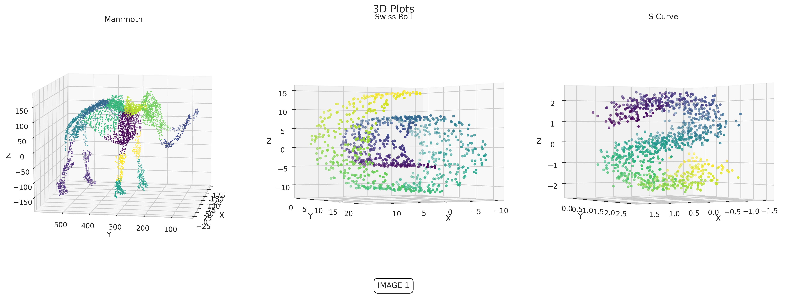
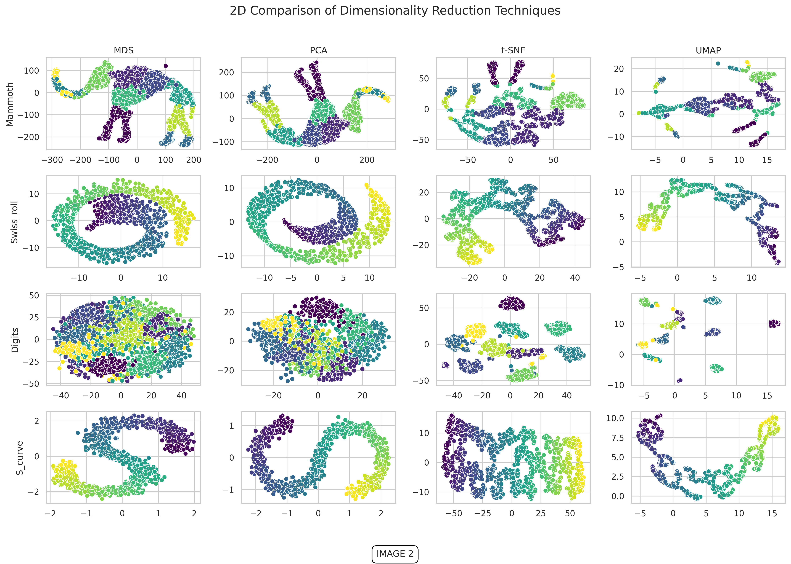

# 3D and 2D Dimensionality Reduction Visualization

This project demonstrates various techniques for dimensionality reduction and clustering using both synthetic and real-world datasets. 
The code covers 3D visualization of clustering results and a comparison of different dimensionality reduction methods in 2D space.

## Overview

*  **3D Visualization**:
   - Generates and visualizes 3D plots of the Swiss Roll and S Curve datasets.
   - Performs agglomerative clustering and K-Nearest Neighbors (KNN) classification on a sample dataset.
   - Displays clustering results using different color maps.

<figure>
  
</figure>

* **2D Dimensionality Reduction Comparison**:
   - Applies various dimensionality reduction techniques (PCA, MDS, t-SNE, and UMAP) on multiple datasets.
   - Compares results in 2D plots to visualize how each technique transforms high-dimensional data.

<figure>
  
</figure>
