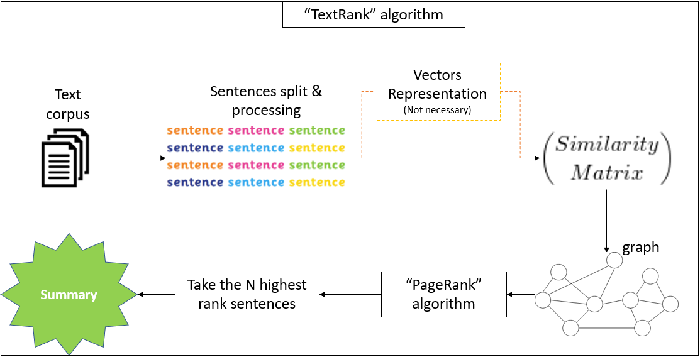

# TextRank algorithm
This is a review on the "TextRank" algorithm, which is an _"extractive summarization"_ algorithm. 

_Extractive summarization_ - Family of methods that extract the important sentences from the whole text and are joined together to get summarization of the text.

The Jupyter notebook `summarisation.ipynb` review the following:
1. **"PageRank" algorithm** - The "TextRank" algorithm is base of the "PageRank" algorithm, so in order to understand "TextRank" we first need to understand "PageRank".
2. **"TextRank" algorithm** - Now implement the elements from "PageRank" to understand "TextRank".
3. **Math of "PageRank" algorithm** - In order to understand better the "PageRank" algorithm, a deeper review of its math.

<figure>
  
</figure>
